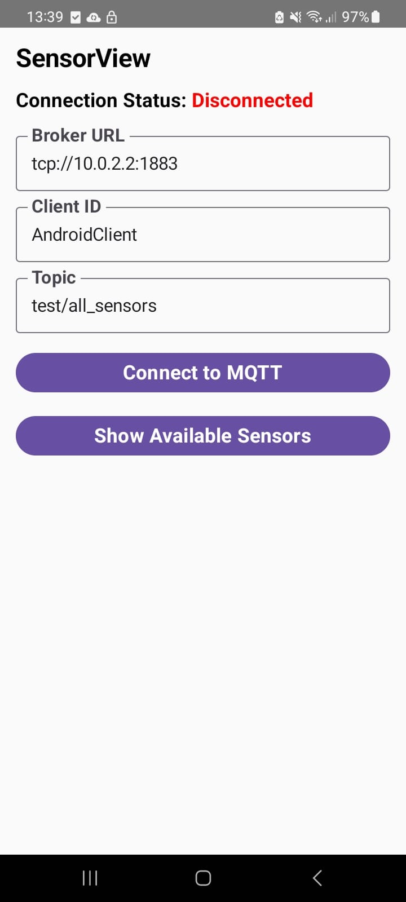
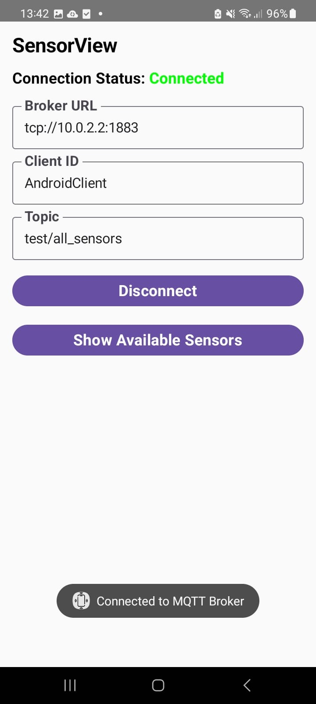
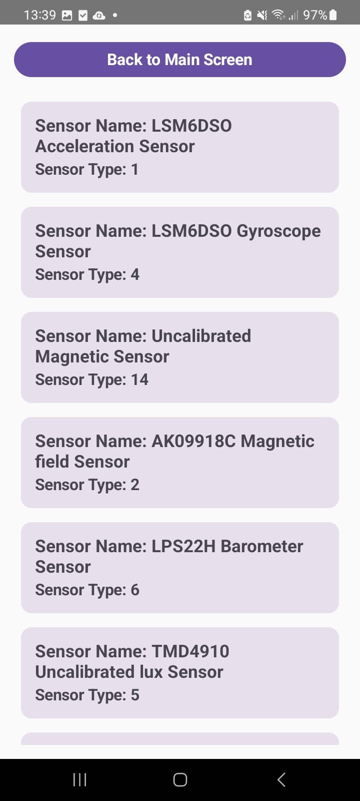
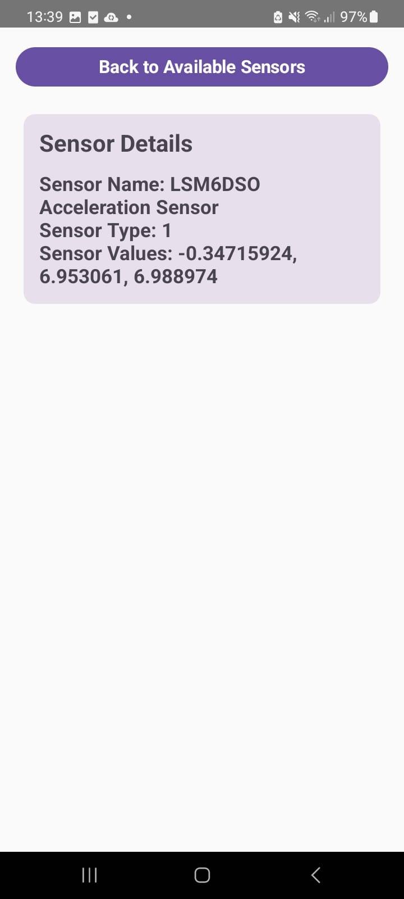
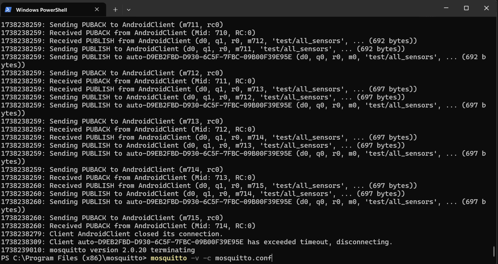

# Android Sensor Data Streamer

This project is an Android app developed using Android Studio that streams sensor data from your phone to an MQTT broker. The app provides a user interface to view available sensors and their current values, along with options to connect to an MQTT broker and stream the data.

Additionally, there’s a Python script that subscribes to the MQTT broker to receive sensor data from the phone, stores the data in a JSON file, and provides basic data visualization.

## Features
- **Display Available Sensors**: The app lists all the available sensors on your Android device and their current readings.
- **MQTT Integration**: Stream sensor data to an MQTT broker in real-time.
- **Visualization**: Data received from the broker is visualized and analyzed through a Python script.

Here's how the system is structured:

```plaintext
          +------------------+
          |  Android Phone   |  <-- Publisher (Sensor Data)
          |  (SensorView App)| 
          +------------------+
                  |
                  |  MQTT
                  v
          +------------------+
          |    Mosquitto     |  <-- Broker (Runs on Laptop)
          |    Broker        |
          +------------------+
                  |
                  |  MQTT
                  v
          +------------------+
          |  Python Script   |  <-- Subscriber (Collect and Visualize Data)
          |  (Subscriber)    |
          +------------------+

        (All components are on the same local network)
```
## SensorView App 

<div style="display: flex; justify-content: space-between;">
  
  
  
  
</div>

## Setup Instructions

### 1. Install Mosquitto Broker on Windows

Follow these steps to install and configure Mosquitto on a Windows machine:

#### Step 1: Download and Install Mosquitto
1. Go to the [Mosquitto download page](https://mosquitto.org/download/).
2. Under "Windows", select the version you need (usually the latest version).
3. Download the installer (e.g., `mosquitto-<version>-install-win32.exe`).
4. Run the installer and follow the on-screen instructions to complete the installation.

#### Step 2: Install Mosquitto as a Service and run it

1. Add the Mosquitto directory to your system’s **PATH** environment variable (default is `C:\Program Files\mosquitto`).
2. Open a **Command Prompt** window as Administrator.
3. Run the following command to install Mosquitto as a service (with custom config, no username or password required):



#### Step 3: Connect to Broker via Android Phone
1. Open the phone app on Android device.
2. Enter the broker's IP address (e.g., 192.168.1.100) and port (1883) in the app settings.
3. Tap Connect to start streaming sensor data to the broker.

#### Step 4: Subscribe to broker with Python Script to collect data
1. Install python libraries: 
   ```bash
   pip install -r requirements.txt
2. Run script to collect data and visualize the data.

